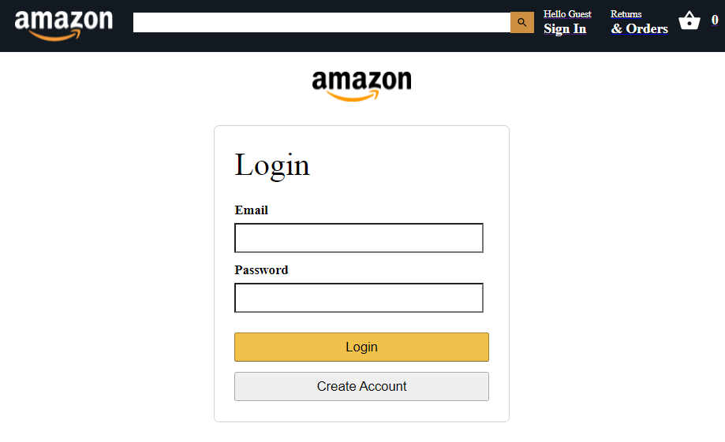
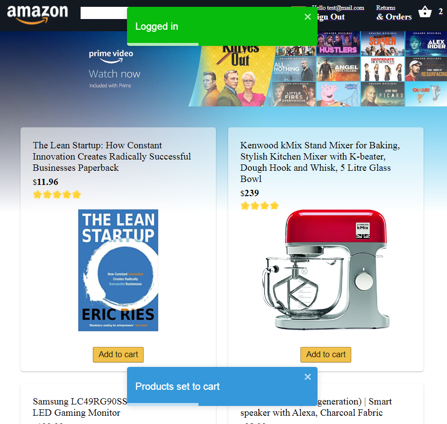
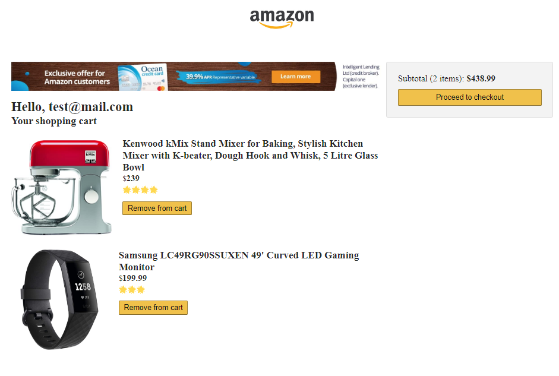

# React Amazon Clone :metal:

### Копия Amazon, разработанная с помощью React, Firebase и Stripe

## Ресурсы

### Firebase

- [JavaScript SDK](https://firebase.google.com/docs/reference/js) - обзор клиентских библиотек `JavaScript` для работы с `Firebase`
- [Auth](https://firebase.google.com/docs/reference/js/firebase.auth.Auth) - сервис для аутентификации
- [Начало работы с Auth](https://firebase.google.com/docs/auth/web/start)
- [Аутентификация с помощью электронной почты и пароля](https://firebase.google.com/docs/auth/web/password-auth)
- [Cloud Firestore](https://firebase.google.com/docs/firestore) - облачная NoSQL-база данных
- [Запись данных](https://firebase.google.com/docs/firestore/manage-data/add-data)
- [Извлечение данных](https://firebase.google.com/docs/firestore/query-data/get-data)
- [Выполнение запросов с условиями](https://firebase.google.com/docs/firestore/query-data/queries)
- [Управление индексами](https://firebase.google.com/docs/firestore/query-data/indexing)

### Stripe

- [Краткое руководство разработчика](https://stripe.com/docs/development/quickstart)
- [Payment Intents API](https://stripe.com/docs/payments/payment-intents) - интерфейс для реализации "намерения совершить платеж"
- [@stripe/stripe-js](https://stripe.com/docs/js/payment_intents/confirm_card_payment) - библиотека `JavaScript` для интеграции с `Stripe`; раздел, посвященный подтверждению оплаты с помощью карты
- [@stripe/react-stripe-js](https://stripe.com/docs/stripe-js/react) - библиотека `React` для интеграции с `Stripe`
- [Тестовые данные](https://stripe.com/docs/testing)

## Запуск проекта

```bash
git clone
cd react-amazon-clone

# установка зависимостей
yarn
# or
npm i

cd functions
yarn
# or
npm i

# заменяем файлы `.env.example` на `.env` и
# `src/fbConfig.example.js` на `src/fbConfig`
# с вашими credentials

# запуск сервера
yarn dev
# or
npm run dev

# запуск React
cd ..
yarn start
# or
npm run start
```

## Структура проекта

```
- functions - сервер; функции для Firebase
  - index.js - основной файл сервера
  - ...
- public
  - index.html - шаблон разметки
- src
  - components - компоненты приложения
    - CheckoutProduct - товар, добавленный в корзину
    - Header - шапка сайта
    - Product - карточка товара
    - Subtotal - общая цена товаров в корзине
    - index.js - повторный экспорт компонентов
  - context
    - actions.js - операции
    - constants.js - константы
    - index.js - провайдер и хук для доступа к контексту
    - reducer.js - редуктор
    - selectors.js - селекторы
  - pages
    - Checkout - страница с товарами в корзине
    - Home - главная страница
      - products.js - товары
    - Login - страница авторизации и регистрации
    - Orders - страница с заказами
    - Payment - страница оплаты
  - App.js - основной компонент приложения
  - fb.js - инициализация Firebase
  - fbConfig.js - настройки Firebase
  - index.css - основной файл со стилями
  - index.js - основной файл приложения
  - routes.js - маршруты приложения
```

## Скриншоты

### Главная страница


### Страница авторизации и регистрации



### Главная страница с сообщениями об успешной автоматической авторизации и добавлении в корзину товаров из локального хранилища



### Страница с товарами в корзине



### Страница оплаты


### Страница с заказами


