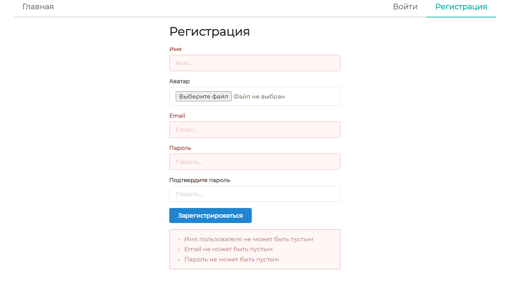
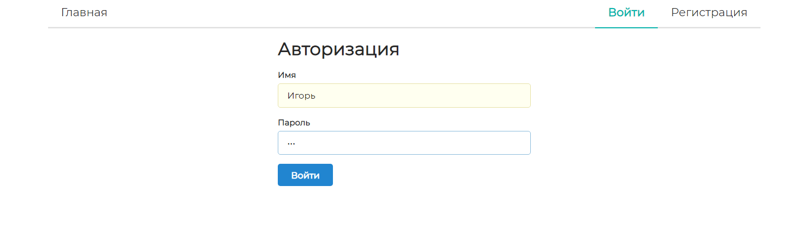
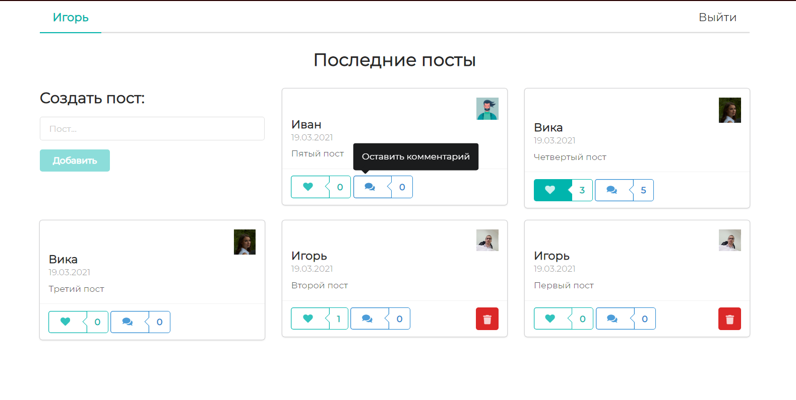
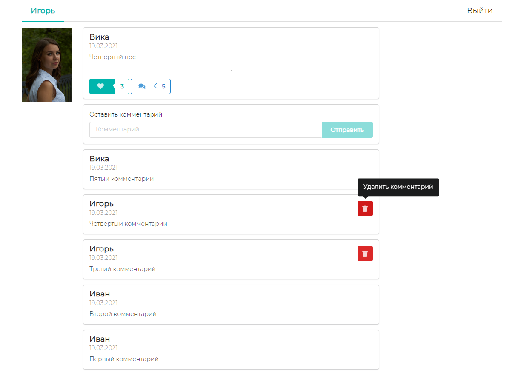
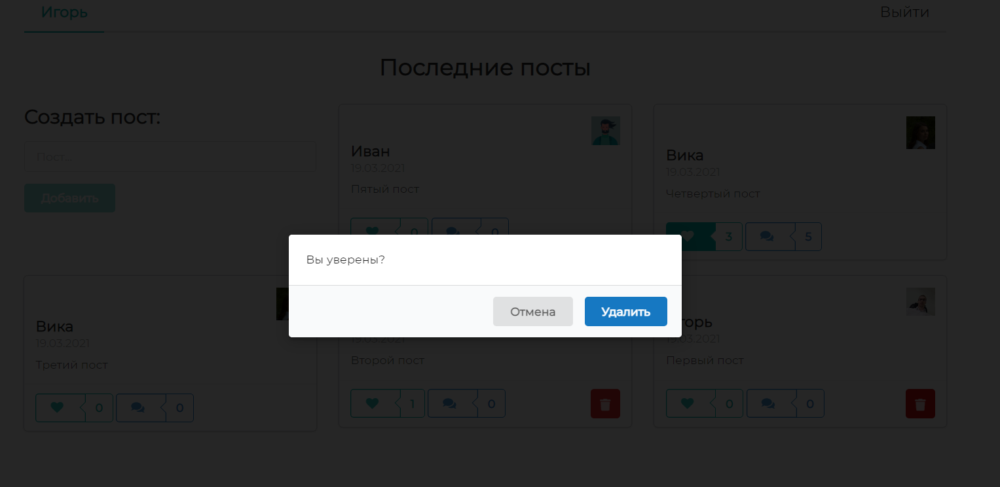
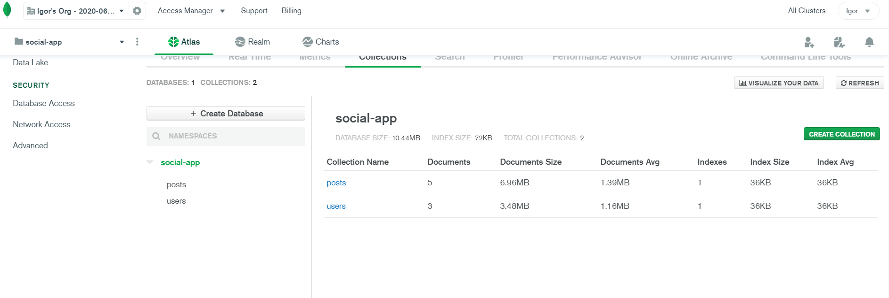

# React Apollo GraphQL Social App :metal:

> Каждая строка кода снабжена подробным комментарием

Проект представляет собой расшифровку и доработку <a href="https://www.youtube.com/watch?v=n1mdAPFq2Os">этого замечательного туториала</a>

## Основные возможности приложения

- Регистрация/авторизация пользователей
- Добавление/удаление постов
- Лайк/дизлайк постов
- Добавление/удаление комментариев к постам
- Отображение количества лайков и комментариев

## Структура проекта

```
- client - клиент
  - public
    - index.html - шаблон разметки
  - src
    - modules
      - components
        - CommentButton.js - кнопка для комментария
        - DeleteButton.js - кнопка для удаления поста или комментария
        - LikeButton.js - кнопка для лайка
        - MenuBar.js - панель навигации
        - PostCard.js - карточка поста, используемая на главной странице
        - PostForm.js - форма для добавления нового поста
        - index.js - агрегация компонентов
      - context
        - auth.js - контекст с информацией об аутентификации
        - ...
      - pages
        - Home.js - главная/домашняя страница
        - Login.js - страница авторизации
        - Register.js - страница регистрации
        - SinglePost.js - страница одного поста
        - index.js - агрегация страниц
      - utils
        - Loader.js - индикатор загрузки
        - MyPopup.js - всплывающая подсказка
        - authRoute.js - утилита для приватного роутинга
        - convertImg.js - утилита для преобразования изображения в base64-строку
        - formatDate.js - утилита для форматирования даты
        - useForm.js - кастомный хук для работы с формой
        - index.js - агрегация утилит
      - graphql.js - запросы и мутации graphql
    - ApolloProvider - провайдер, позволяющий установить связь с сервером
    - App.css - коррекция стилей semantic
    - App.js - основной компонент приложения
    - index.js - главный файл клиента, точка входа для Webpack
  - jsconfig.json - настройки компилятора
  - ...
- graphql
  - resolvers - операции, выполняемые с данными в ответ на запрос или мутацию graphql
    - comments.js - мутации для комментариев
    - posts.js - запросы и мутации для постов
    - users.js - мутации для пользователей
    - index.js - агрегация запросов и мутаций
  - typeDefs.js - определения типов (моделей) данных, запросов и мутаций
- models
  - Post.js - модель поста
  - User.js - модель пользователя
- utils
  - check-auth.js - утилита для проверки аутентификации
  - validators.js - валидаторы для регистрации и авторизации
- index.js - главный файл сервера
- ...
```

## Стек технологий

*Сервер*:

- Apollo Server
- GraphQL + GraphQL Tag
- Mongoose
- JSON Web Token
- Bcrypt
- Supervisor
- Concurrently

*Клиент*:

- React
- ReactDOM
- React Router DOM
- Apollo Client
- GraphQL + GraphQL Tag
- JWT Decode
- React Loader Spinner
- Semantic UI React

## Запуск приложения

Для запуска приложения необходимо сделать следующее:
- Клонировать репозиторий

```js
git clone https://github.com/harryheman/React-Social-App.git
```

- Установить зависимости сервера и клиента

```bash
yarn
# или
npm i

cd client

yarn
# или
npm i
```

- Создать базу данных в MongoDB Atlas (MongoDB Cloud)
- Создать файл `config.js` в корневой директории проекта (react-social-app) с MongoDB URI и "солью" для шифрования пароля

```js
module.exports = {
  MONGODB: 'mongodb+srv://<username>:<password>@cluster0.pscjo.mongodb.net/<dbname>?retryWrites=true&w=majority',
  SECRET: 'secret'
}
```

- Выполнить команду, находясь в корневой директории проекта

```bash
yarn start
# или
npm start
```

## Скриншоты приложения

Регистрация



Авторизация



Главная страница



Страница поста



Удаление поста или комментария



База данных


